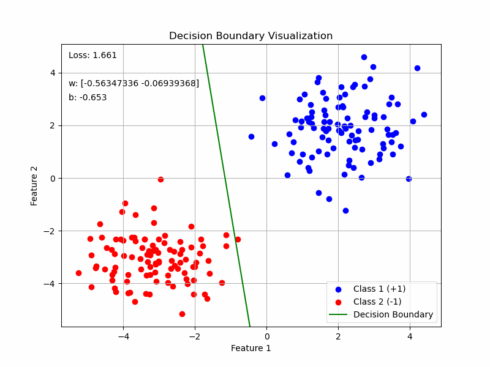

# svm-classification

This repository contains a Jupyter Notebook (`Rosenblats perceptrone.ipynb`) demonstrating the implementation of Rosenblatt's Perceptron and a Support Vector Machine (SVM) for binary classification.  The notebook visualizes the decision boundary learned by each algorithm, including an animation of the perceptron's learning process.
 

<<<<<<< HEAD
This project aimgis to provide a clear and concise understanding of two fundamental classification algorithms:
=======
This project aims to provide a clear and concise understanding of two fundamental classification algorithms:
>>>>>>> 6efdc42 (Update)

* **Rosenblatt's Perceptron:** A simple linear classifier that iteratively updates its weights to minimize misclassifications.
* **Support Vector Machine (SVM):** A more robust linear classifier that aims to find the optimal hyperplane maximizing the margin between classes.

The notebook includes:

* **Data Generation:**  A function `generate_data` creates synthetic 2D data points belonging to two distinct clusters.  The means of these clusters can be easily adjusted for experimentation.  An example with 3D data is also included, although the visualization for this case is not fully implemented.
* **Perceptron Implementation:** The perceptron algorithm is implemented with a `peceptrone_loss` function and a `stochastic_subgradient` function for training.  Minibatches are used for gradient updates.
* **SVM Implementation:** The SVM is implemented using a `hinge_loss` function and an `svm` function for training, similar to the perceptron.  Regularization is incorporated using the L2 norm of the weights.
* **Decision Boundary Visualization:** Functions `visualize_decision_boundary` and `animate_decision_boundary` provide static and animated visualizations of the decision boundaries learned by the classifiers.  The animation showcases the perceptron's iterative learning process.
